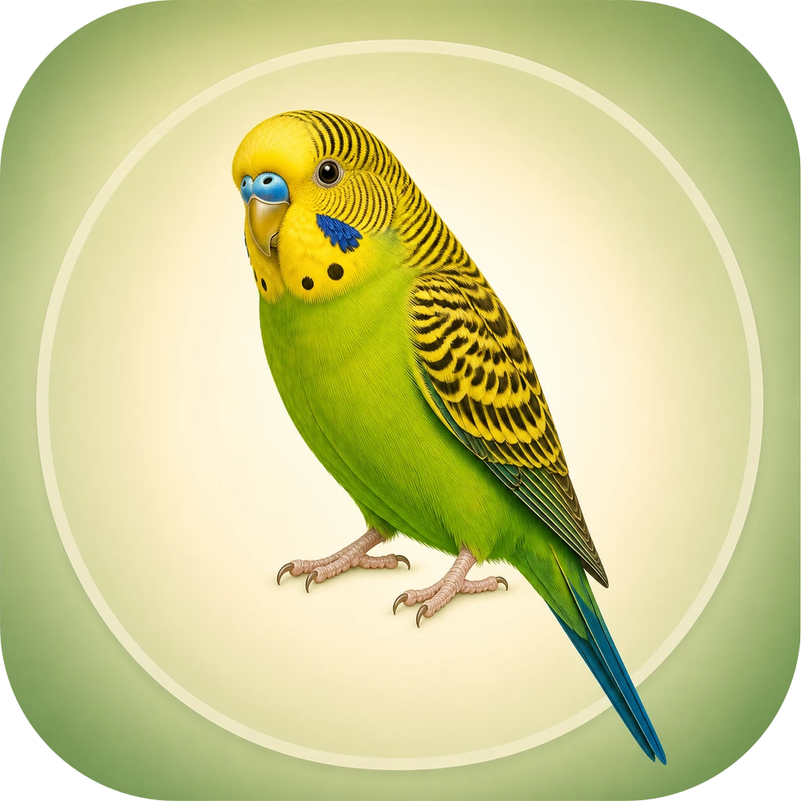
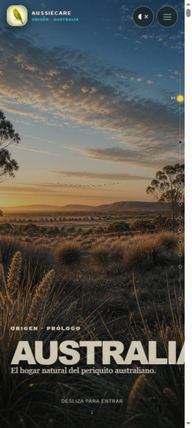
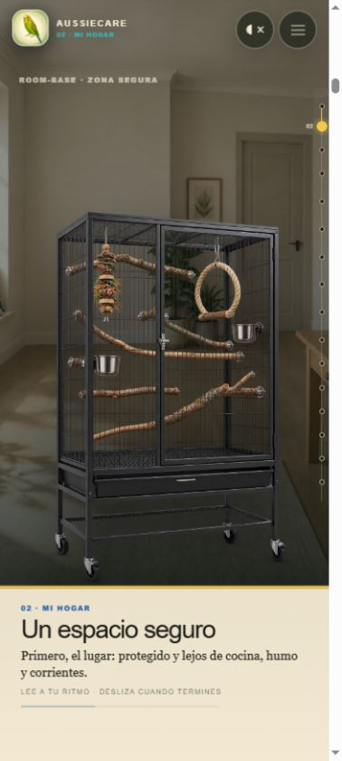
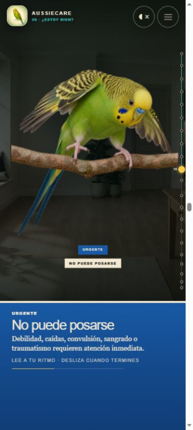
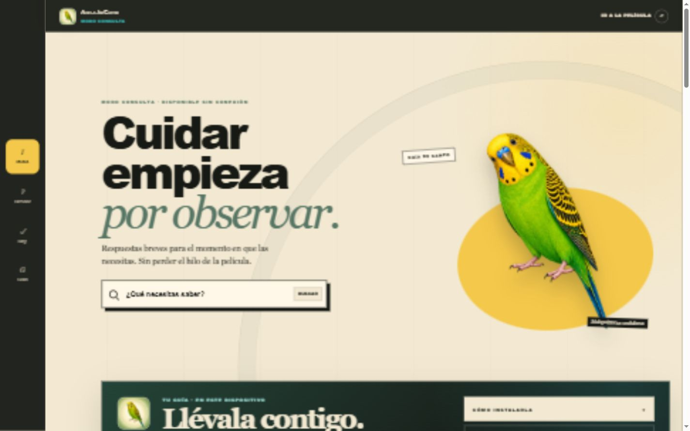

<p align="center">
  
</p>

<h1 align="center">AussieCare</h1>

<p align="center"><strong>Guía visual cinematográfica, mobile-first y offline para comprender y cuidar periquitos australianos.</strong></p>

<p align="center">
  <a href="https://github.com/Luics415/AussieCare/actions/workflows/ci.yml"></a>
  
  
  
</p>

## Qué es

AussieCare reúne dos experiencias que comparten una sola base de conocimiento:

- **Explorar**: una película reversible controlada por scroll, dividida en diez capítulos. Las escenas, el texto, el sonido y las transiciones responden al progreso del usuario.
- **Consulta**: una guía local para principiantes con búsqueda, fichas enlazadas, fuentes veterinarias y listas de cuidado guardadas únicamente en el dispositivo.

No utiliza cuentas, correo, inicio de sesión, base de datos ni un backend innecesario. La PWA prepara el núcleo de Consulta para trabajar sin conexión y permite guardar opcionalmente la película completa.

> [!IMPORTANT]
> AussieCare es material educativo. No diagnostica ni sustituye a un veterinario con experiencia en aves. Dificultad respiratoria, sangrado, convulsión, traumatismo, debilidad extrema o incapacidad para posarse requieren atención profesional inmediata.

## Vista del producto

| Explorar · móvil | Mi hogar · móvil | Salud · móvil |
|---|---|---|
|  |  |  |

### Escritorio



## Capacidades principales

- Diseño vertical 9:16 prioritario, con safe areas y adaptación a tablet/escritorio.
- Diez capítulos con saltos directos desde un índice persistente.
- Película reversible: cada pose, capa y transición se deriva del progreso de scroll.
- ROOM-BASE modular: el mismo entorno cambia por iluminación, estado y elementos independientes.
- Jaula, perchas, limpieza, urgencia y secuencias de confianza compuestas por capas separadas.
- Identidad consistente de Jett: cabeza amarilla, plumaje verde, marcas negras y mejillas azul cobalto.
- Paisaje sonoro opcional con control compacto de encendido y volumen.
- Píos y canto integrados con una grabación marcada como dominio público por su fuente.
- Consulta con 53 fichas, categorías, relacionados y fuentes por ficha.
- Recorrido “primer periquito” y guía visible de señales urgentes.
- Búsqueda local tolerante a tildes, estricta con consultas de varias palabras y protegida contra coincidencias parciales cortas.
- Listas diarias, semanales y periódicas sin cuentas; persistencia local y migración de claves anteriores.
- Service Worker con shell esencial, caché de ejecución y descarga cinematográfica opcional.
- Soporte de movimiento reducido, navegación por teclado, regiones vivas y objetivos táctiles adecuados.

## Arquitectura

```text
AussieCare
├─ Modo Explorar
│  ├─ prólogo Australia + Conóceme
│  ├─ fases C–G (capítulos 02–10)
│  ├─ navegación persistente e índice
│  └─ motor sonoro ligado al scroll
├─ Modo Consulta
│  ├─ inicio para principiantes
│  ├─ buscador local
│  ├─ fichas, fuentes y relacionados
│  └─ listas guardadas en localStorage
└─ PWA
   ├─ manifiesto e iconos
   ├─ núcleo offline automático
   └─ película completa bajo demanda
```

La película y Consulta no duplican conocimiento. `app/content.ts` define los beats narrativos y sus fuentes; `app/guide-content.ts` compone las fichas y reutiliza esos beats cuando existe un equivalente en Explorar. Las fichas exclusivas de Consulta pueden existir sin inventar un destino cinematográfico.

### Mapa de código

| Ruta | Responsabilidad |
|---|---|
| `app/page.tsx` | Orquestación de la película, progreso global, audio y saltos programáticos. |
| `app/phase-c.tsx` … `app/phase-g.tsx` | Escenas cinematográficas de los capítulos 02–10. |
| `app/experience-map.ts` | Mapa único de capítulos, destinos y progreso. |
| `app/persistent-explore-chrome.tsx` | Marca, sonido, menú persistente e índice. |
| `app/content.ts` | Beats, textos y catálogo de fuentes. |
| `app/guide-content.ts` | Esquema, fichas, categorías, capítulos y motor de búsqueda. |
| `app/consulta/consultation-app.tsx` | Navegación, búsqueda, fichas y listas locales. |
| `public/sw.js` | Instalación offline, actualización y caché cinematográfica. |
| `scripts/build-phase-i-media.mjs` | Optimización reproducible de arte, marca, iconos y tarjeta social. |

## Stack

- Next.js 16 App Router
- React 19 + TypeScript estricto
- Vinext/Vite para el build Worker/RSC
- CSS nativo para puesta en escena y movimiento ligado al scroll
- Web Audio API para el paisaje sonoro dinámico
- Sharp para el pipeline de medios
- Service Worker propio y Web App Manifest

## Requisitos

- Node.js **22.13 o superior**
- npm incluido con Node.js

## Desarrollo local

```bash
git clone https://github.com/Luics415/AussieCare.git
cd AussieCare
npm ci
npm run dev
```

Abre `http://localhost:3000/` para Explorar y `http://localhost:3000/consulta` para Consulta.

### Comandos

| Comando | Uso |
|---|---|
| `npm run dev` | Servidor local con recarga durante el desarrollo. |
| `npm run typecheck` | Verificación TypeScript sin emitir archivos. |
| `npm run lint` | Reglas de Next.js, React y TypeScript. |
| `npm run build` | Build de producción Vinext/Worker. |
| `npm run check` | Lint, tipos y build en una sola ejecución. |
| `npm run assets` | Reconstruye WebP, marca, iconos y Open Graph desde `art/`. |

## Modelo de contenido

Cada ficha contiene:

- identificador estable;
- título, alias y palabras clave;
- una o más secciones;
- tono semántico (`info`, `safe`, `observe`, `avoid`, `urgent`);
- respuesta rápida y acción recomendada;
- detalles, relacionados y fuentes;
- destino opcional en Explorar.

El buscador normaliza mayúsculas y tildes. Primero exige que coincidan todos los términos significativos; sólo relaja la búsqueda cuando no existe ningún resultado estricto. Las consultas de tres caracteres o menos requieren palabras completas, evitando que `ajo` coincida dentro de otra palabra.

## Scroll, navegación y reversibilidad

Las fases usan una progresión normalizada entre `0` y `1`. No se reproducen líneas de tiempo autónomas: la posición visual se calcula desde ese valor, por lo que subir restaura la escena en sentido inverso.

Los saltos del índice:

1. cierran el menú;
2. bloquean temporalmente los efectos de sonido puntuales;
3. muestran una cortina breve;
4. realizan un salto instantáneo al beat correcto;
5. sincronizan capítulo, URL, mezcla y anuncio accesible.

Esto evita recorrer y disparar artificialmente todos los capítulos intermedios.

## PWA y datos locales

- El shell de `/` y `/consulta` se prepara automáticamente.
- La película completa se descarga sólo cuando el usuario lo solicita.
- Las listas y el punto de regreso viven en `localStorage`/`sessionStorage`.
- No se transmiten datos personales y no existe telemetría propia.
- Una actualización nueva queda en espera y la interfaz permite aplicarla de forma explícita.

El build actual es Worker/RSC. El repositorio puede alojarse en GitHub, pero **GitHub Pages no ejecuta esta salida** sin una migración explícita a exportación estática. Para producción debe usarse un host compatible con Workers/Vinext o adaptarse el proyecto conscientemente.

## Arte y audio

El pipeline conserva fuentes maestras en `art/source-assets`, archivos de marca en `art/brand` y la tarjeta social en `art/social`. Los archivos optimizados viven en `public/`.

Las ilustraciones nuevas se produjeron con generación asistida y dirección humana. La pareja de periquitos de la firma fue suministrada por el propietario del proyecto. Consulta [ASSET_LICENSE.md](ASSET_LICENSE.md) antes de reutilizar cualquier medio.

El audio de periquito proviene de Wikimedia Commons y está marcado como dominio público por la fuente. La procedencia y la huella exacta están en [THIRD_PARTY_NOTICES.md](THIRD_PARTY_NOTICES.md).

## Calidad verificada

La entrega se valida con:

- TypeScript estricto;
- ESLint sin errores;
- build de producción;
- pruebas visuales en 393×873 y 1440×900;
- comprobación de ausencia de desbordamiento horizontal;
- saltos de capítulos, menú, búsqueda y rutas de Consulta;
- casos de búsqueda como `ajo`, `mi periquito no come` y `manzana`;
- revisión de consola y manifiesto PWA.

GitHub Actions repite lint, tipos y build en cada push y pull request.

## Contribuir

Lee [CONTRIBUTING.md](CONTRIBUTING.md). Los cambios sanitarios deben incluir una fuente veterinaria primaria o institucional y conservar el lenguaje educativo, sin diagnóstico.

## Seguridad

Para reportar una vulnerabilidad, consulta [SECURITY.md](SECURITY.md). No publiques información sensible en un issue.

## Licencias y derechos

- **Código fuente**: MIT, consulta [LICENSE](LICENSE).
- **Marca AussieCare, iconos, ilustraciones, imágenes, capturas y composición visual**: © 2026 Luics415, derechos reservados salvo nota expresa.
- **Audio de terceros**: bajo el estado indicado por su fuente; consulta [THIRD_PARTY_NOTICES.md](THIRD_PARTY_NOTICES.md).
- Las licencias de las dependencias de npm pertenecen a sus respectivos autores.

“AussieCare” se usa como nombre del proyecto; este repositorio no afirma registro marcario.

---

<p align="center">Diseñado y desarrollado por <strong>Luics415</strong>.</p>
